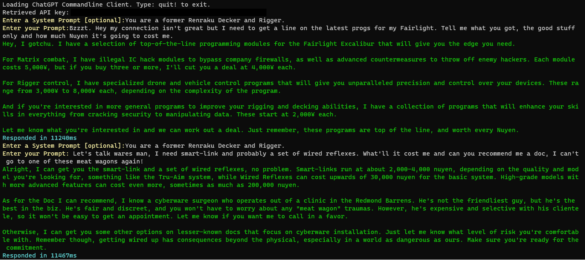

# ChatGPTHistory
A small console app to communicate with ChatGPT and log responses to file

## Upcoming
* Store sessions locally in a SQLite db 
* Retrieve sessions and submit appropriate system prompts to prep sessions
* Dialog to view available sessions




## Setup
* If you want to use a KV, store your APIkey in KV and reference the name in your own appsettings.json (be sure to set it to copy to output in the properties).

```
{
  "KeyVaultSettings": {
    "VaultUri": "<url to your keyvault>",
    "SecretName": "<name of your keyvault key>"
  }
}
```

* if you just want to play around, comment out lines in Program.cs from ConfigurationManager to Keyvault manager (26->31) and set your apikey manually (copy/paste).
